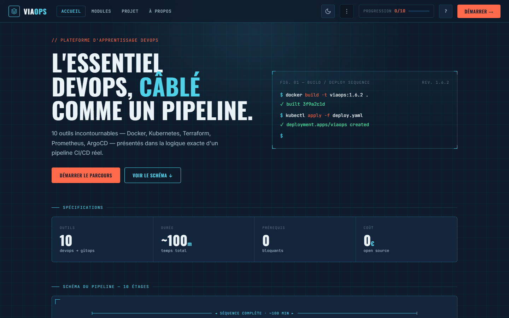

# ViaOps — La voie DevOps 🚀

**Plateforme d'apprentissage DevOps** — 9 outils essentiels en 10 minutes chacun, structurés comme un vrai pipeline CI/CD.

[](https://github.com/seydinalimamoulayeyade/viaops)
[](https://github.com/seydinalimamoulayeyade/viaops/actions/workflows/deploy.yml)
[](LICENSE)
[](https://hub.docker.com/r/lims4/viaops)

---

## 🎬 Aperçu



> 🔗 **[Démo en ligne](https://seydinalimamoulayeyade.github.io/viaops)** · 🧩 **[Projet fil rouge](https://github.com/seydinalimamoulayeyade/viaops-zero-to-prod)**

---

## 🎯 Vision

**ViaOps** n'est pas un cours traditionnel. C'est un **compagnon de démarrage DevOps** :
- ✅ **On entre sans savoir**, on sort avec l'essentiel opérationnel
- ✅ **10 minutes par outil**, zéro blabla
- ✅ **Structuré comme un pipeline CI/CD** réel
- ✅ **Ce qu'il faut dire en entretien** inclus

---

## ⚡ Quick Start

```bash
# Option 1 : Sans installation
open index.html

# Option 2 : Avec Docker
docker run -p 8080:80 lims4/viaops:latest
# → http://localhost:8080

# Option 3 : Live
# → https://seydinalimamoulayeyade.github.io/viaops
```

---

## 🛠️ Les 9 modules

| Module | Thème | Durée |
|--------|-------|-------|
| 01 · **DevOps** | Culture & CALMS | 10 min |
| 02 · **Docker** | Conteneurisation | 10 min |
| 03 · **Jenkins** | CI/CD Automation | 10 min |
| 04 · **SonarQube** | Code Quality | 10 min |
| 05 · **Kubernetes** | Orchestration | 10 min |
| 06 · **Terraform** | Infrastructure as Code | 10 min |
| 07 · **Prometheus/Grafana** | Monitoring | 10 min |
| 08 · **Trivy** | Security Scanning | 10 min |
| 09 · **IA pour DevOps** | Automation AI | 10 min |

**Total : ~90 minutes** pour l'essentiel DevOps.

### 🌟 Module Bonus

| Module | Thème | Durée |
|--------|-------|-------|
| 10 · **ArgoCD** | GitOps & Continuous Deployment | 10 min |

Découvrez le GitOps avec ArgoCD pour automatiser vos déploiements Kubernetes !

---

## 📚 Structure de chaque module

```
01 · Le problème        → Quelle douleur existait avant ?
02 · Concepts clés      → 3-5 notions fondamentales
03 · Commandes ref.     → Config centrale annotée
04 · Place pipeline     → Où l'outil s'insère
05 · Quiz & Entretien   → Validation + préparation recruteur
```

---

## ✨ Fonctionnalités

### Core
- 🎨 **Design Paper Mode** — Mode sombre/clair avec toggle
- ⌨️ **Raccourcis clavier** — `H`/`M`/`A`/`←`/`→`/`?`
- 🏆 **Certificat PNG** — Auto-généré à 9/9 modules
- 📱 **100% Responsive** — Mobile-first
- 🚀 **0 dépendances** — Vanilla JS/CSS

### Nouveautés v1.6.0 — Refonte « Blueprint »
- **Nouvelle direction visuelle** — esthétique plan technique : fond ardoise + grille, lignes cyan, corail signal, police Oswald
- **Pipeline câblé** — la Home présente le pipeline comme un schéma d'ingénieur annoté (références, cotation, fils)
- **Parcours fil rouge « De zéro à la prod »** — une vue Projet qui relie les 10 modules en un déploiement complet, du `git push` à la production
- **Thème clair repensé** en « blueprint inversé » (papier + lignes bleues)

### Nouveautés v1.5.0
- **Quiz de validation** — 4 questions par module, une par une, avec feedback immédiat
- **Complétion conditionnée** — un module se valide à partir de **75 %** de réussite au quiz
- **Score rejouable** — meilleur score mémorisé et affiché par module
- **Refonte visuelle** — vrais logos d'outils (SVG), icônes SVG à la place des emojis, titres en casse normale

### Nouveautés v1.1.0
- **Scroll to Top** — Bouton flottant pour remonter rapidement
- **Recherche modules** — Filtre temps réel dans la sidebar
- **Menu progression** — Export JSON, partage, réinitialisation
- **Accessibilité** — Focus states WCAG 2.1 AA
- **Transitions fluides** — Animations entre les vues

---

## 🏗️ Stack

```
Frontend    →  HTML5 / CSS3 / Vanilla JS
Container   →  Docker + nginx
CI/CD       →  GitHub Actions
Hosting     →  GitHub Pages
```

**~4,200 lignes de code · 0 framework · 0 build step**

---

## 📖 Documentation

- 📋 **[CHANGELOG.md](CHANGELOG.md)** — Historique des versions et changements

---

## 🚢 Déploiement

### Docker

```bash
# Pull
docker pull lims4/viaops:latest

# Run
docker run -d -p 8080:80 --name viaops lims4/viaops:latest

# Visit
open http://localhost:8080
```

### GitHub Pages

Automatique à chaque push sur `main` via GitHub Actions.

---

## 🤝 Contribution

Contributions bienvenues !

```bash
git clone https://github.com/seydinalimamoulayeyade/viaops.git
cd viaops
# Modifier les fichiers
git checkout -b feature/ma-feature
git commit -m "feat: ma nouvelle fonctionnalité"
git push origin feature/ma-feature
# Ouvrir une Pull Request
```

---

## 📄 License

MIT License — Utilisez, modifiez, partagez librement.

---

## 👤 Auteur

**Virtual Voyager** · Dakar, Sénégal  
MERN Stack Developer → Cloud & DevOps Engineer

- 🔗 [LinkedIn](https://linkedin.com/in/limamou-laye)
- 🐳 [Docker Hub](https://hub.docker.com/r/lims4/viaops)
- 📧 contact@viaops.dev

---

<div align="center">

**Construit avec ❤️ à Dakar, Sénégal · 2026**

⭐ Star ce projet si tu l'as trouvé utile !

</div>
